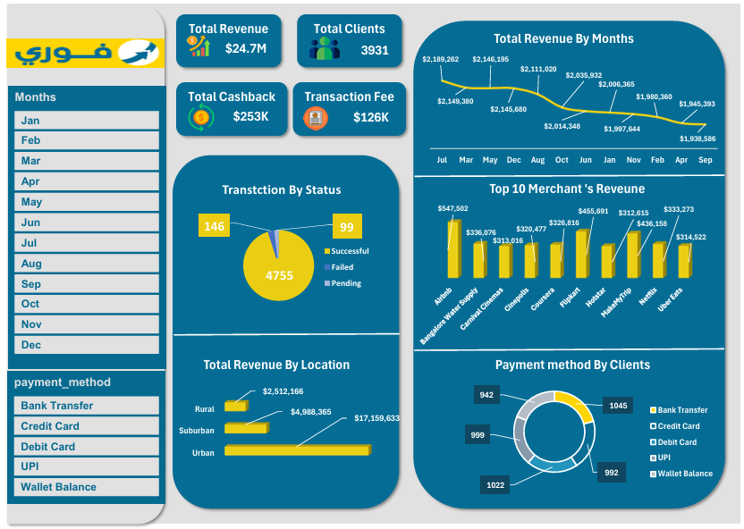

# 📊 fawry-business-dashboard-analysis-excel

## 🚀 Overview
This project presents an interactive business dashboard built using **Microsoft Excel**, based on simulated commercial data inspired by a digital payments company like Fawry.

The main objective is to transform raw transactional data into clear, actionable insights that support business decision-making.

---

## 📌 Key Features
- 💰 Analysis of Total Revenue, Cashback, and Transaction Fees  
- 👥 Insights into Total Clients and customer behavior  
- 📈 Monthly Revenue Trends visualization  
- 🏪 Top 10 Merchants ranked by revenue  
- 🌍 Revenue distribution across different locations  
- 💳 Payment Methods breakdown  
- ✅ Transaction Status analysis (Successful, Failed, Pending)  

---

## 🛠️ Tools & Technologies
- Microsoft Excel  
  - Pivot Tables  
  - Pivot Charts  
  - Data Cleaning  
  - Dashboard Design  

---

## 📊 Dashboard Preview

---

## 🎯 Objectives
- Clean and preprocess raw transactional data  
- Build a fully interactive dashboard  
- Extract meaningful business insights  
- Improve data visualization and storytelling skills  

---

## 📈 Key Insights
- Top-performing merchants contribute significantly to total revenue  
- Revenue trends vary across months, highlighting peak periods  
- Customer transaction behavior provides valuable business signals  
- Majority of transactions are successful, indicating system reliability  

---

## 📂 Project Structure

 ┣ 📄 README.md
 ┣ 📄 Fawry_Dashboard.xlsx
 ┗ 📄 sales-analysis-dashboard-img.png

---

## 🤝 Let's Connect
I'm currently transitioning into the **Data Analysis field** and actively building real-world projects.

Feel free to connect with me on LinkedIn and share your feedback!

---

## ⭐ Support
If you like this project, consider giving it a ⭐ to support my work!
